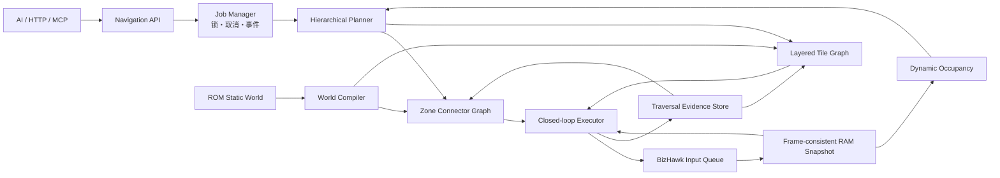
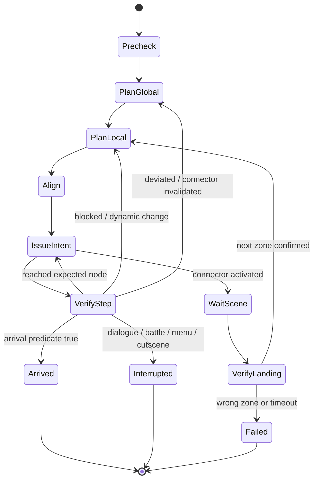

# Pokémon Black 2 自动寻路总体设计

状态：设计基线
范围：AI/API 驱动的同地图与跨地图自动寻路
核心约束：ROM 是静态候选世界，RAM 是运行时事实；执行只使用有证据的坐标、边和地图连接

## 1. 目标与完成定义

自动寻路不是一次性输出方向键列表，而是一个可取消、可观察、会逐步验证并在环境变化时重规划的导航任务。调用者只描述目的地和策略，系统负责解析当前位置、规划同层路径、经过门或传送点切图、避让动态角色、处理加载阶段并验证最终到达。

功能达到发布标准时应满足：

1. AI 或普通 HTTP/MCP 客户端可用稳定的目标描述启动规划或执行。
2. 室内、室外、桥上桥下、楼梯、坡道、跳台、水面等不会被压成错误的二维平面。
3. 跨地图只能通过已验证的有向连接，切图后必须确认新 Zone 和落点再继续。
4. 每次移动输入之后都读取运行时位置验证；受阻、偏航、NPC 占道或状态切换时等待、重试或重规划。
5. `succeeded` 只表示满足到达条件。中断、不可达、不确定和失败是不同终态。
6. 所有路线边都有来源、置信度、适用 ROM、能力条件和成功/失败证据。
7. 未知碰撞默认不会被当成可通行；可选的安全探索也必须是单步、有限预算、可停止的。

不把战斗策略、剧情决策或自动选择对话纳入第一版。导航遇到这些状态时按照调用者策略暂停、返回控制权或在明确允许时执行简单恢复动作。

## 2. 现状审查与必须先解决的问题

项目已有可复用的基础：

- PlayerRuntime 能从 Field 对象链读取 `ZoneID`、`GPos`、`WPos`、朝向、移动阶段、交通方式、脚下 tile 和 Mapper/Chunk。
- canonical world 约定每格 16 world units；静止格中心为 `WPos.x = GPos.x * 16 + 8`、`WPos.z = GPos.z * 16 + 8`。
- ROM 读取器可解析 Zone、Area、Matrix、Chunk、原始 permission planes、NPC、家具、warp 和 trigger。
- Observed Navigation Graph 使用 `(zone_id, x, y, z)`，已经避免桥上桥下共用同一个二维节点。
- Field/Mapper/ActorSystem 在地图切换后失效时，Runtime locator 已有节流重发现机制。
- ROM-wide map graph 已能保存 Zone 和 warp 候选关系，且不把未经实机证明的目标字段冒充事实。

这些模块尚未组成执行级寻路：

- 遗留二维 A* 把 SemanticState 的 WPos `x/y` 当作格子平面，而正确的格子平面是 GPos `x/z`，`y` 是高度层。
- 遗留碰撞分类猜测 permission byte 含义，只读取 plane 0；仓库的权威 ROM reader 明确声明这些字节目前只有 raw 语义。
- 遗留 NavigationGrid 默认全可走，缺失 chunk/model 会留下假通路，目标格还会绕过 walkability 检查。
- `dynamic_obstacles` 没有任何填充路径；建筑、NPC、运行时 prop 并未进入执行规划。
- 遗留执行器按固定帧长发送方向键，不验证期望下一格；偏航、撞墙和 `max_steps` 截断后仍可能返回 `completed`。
- Observed Graph 当前只规划同 Zone，明确跳过 `zone_transition`；跨图边也缺少入口、触发动作、落点和输入因果证据。
- RuntimeHub 把 raw PlayerRuntime 直接传给只读顶层 `grid` 的观察器，而 raw grid 位于 `position.grid`，所以后台自动学习目前不能正常记录。
- 任意相邻样本或 Zone 改变都可能被记边，缺少 frame 连续性、session、加载过程、savestate、飞行/脚本传送等隔离。
- 当前生产 `runtime/navigation/observed_graph.json` 已含测试样本；测试依赖全局 store，证据必须按 ROM 与运行 session 隔离。

因此新系统不扩展遗留 `/api/v1/nav/*` 的数据模型。旧接口标记 deprecated，执行端继续默认关闭，并最终只保留显式的诊断兼容层。

## 3. 唯一坐标与身份契约

执行级节点定义为：

```text
MapRef {
  game_id, rom_sha256, zone_id, matrix_id, scene_generation
}

GridPos { x, y, z }

NavNodeKey = rom_sha256 + zone_id + matrix_id + x + y + z + traversal_mode
```

- `x/z` 是水平格子轴，`y` 是高度或楼层层级。
- `WPos{x,y,z}` 只用于运动插值、格心验证和 3D 素材对齐，不作为 tile planner 输入。
- `zone_id` 是地图拓扑身份；`location_name_id`、parent Zone 和 UI 名称是元数据。
- `matrix_id` 与 `zone_id` 不得混用。共享 Matrix 必须按当前 Zone 的 active cells 裁剪。
- `scene_generation` 在 Field 生命周期更换、读档或运行 session 变化时递增，使旧 snapshot、actor occupancy 和局部 plan 自动失效。
- 所有持久化数据带 `game_id + rom_sha256 + schema_version`，不同 ROM 版本绝不共用证据。

API 禁止继续使用含义模糊的二维 `{x, y}`。未给 `y` 时，解析器只有在给定 `x/z` 附近存在唯一高度层时才能自动补全；否则返回 `NAV_LAYER_AMBIGUOUS`。

## 4. 总体架构



### 4.1 WorldSnapshotProvider

一次快照必须尽量在同一 emulator frame 或同一 batch 内提供：

- Player：Zone、GPos、WPos、Facing、movement phase、transport mode、tile-under、collision box。
- Mapper：matrix、active cells、chunk size、player chunk、scene generation。
- Actors：同场 NPC/actor 的 GPos、collision box、移动方向/速度、样本 frame。
- Game context：field 可控、对话、菜单、战斗、过场、loading、输入队列状态。
- 数据质量：frame、frame skew、每个来源的 confidence、locator lifecycle 状态。

标准状态为 `READY | MOVING | TRANSITIONING | INTERRUPTED | UNRESOLVED`。执行器只有在 `READY` 时发出新的移动 intent。ActorSystem header 与 heap 若不能同批读取，必须暴露 frame skew，并在超过阈值时保守地延长占用 TTL。

### 4.2 NavigationWorldCompiler

按 ROM hash 离线编译：

- Zone/Area/Matrix/Chunk 身份和 Zone active-cell 边界。
- 每个 tile 的所有 raw permission plane bytes，不提前写死可通行语义。
- warp、trigger、NPC spawn、家具、door metadata 和原始坐标变换状态。
- terrain/building mesh 的 broad-phase bounds，作为风险和几何候选。

建筑 mesh 不能直接成为最终碰撞真值：门洞、悬挑、桥下空间和嵌在 terrain 内的建筑都可能让简单 footprint 封格出错。最终通行由已验证 permission 规则、运行时 tile 信息和成功/失败边共同裁决。

### 4.3 TraversalEvidenceStore

每次有因果关系的移动尝试保存：

```text
attempt: from_node, command, capability_snapshot,
         raw_permission_vector, tile_under, actor_occupancy,
         frame/session/scene_generation
result:  to_node | unchanged | transition | interruption,
         settle_frames, failure_kind, observed context
```

边记录 `success_count`、`failure_count`、`first_seen`、`last_seen`、`direct_observations`、`source`、`confidence`、`one_way`、`requirements` 和 `risk`。普通边也不因一次正向成功就自动认定反向可走；跳台、传送带、楼梯和脚本移动必须保持有向。

生产 store、fixture store 和单元测试 store 通过依赖注入分开。启动时拒绝读取 ROM hash 不匹配或来源标记为 test 的证据。

### 4.4 LayeredTileGraph

局部图节点始终包含 `GPos.y`，边至少有：

- `walk`、`run`、`bike`、`surf`
- `stair_up/down`、`slope`、`ledge`
- `forced_movement`
- `interaction`

边是有向的，并带能力、道具/flag、交通方式切换和置信度要求。静态 permission 规则只有通过足够的“输入前后位置 + raw plane vector + runtime tile + 能力”的对照证据后，才可批量生成候选边。未知 tile 默认不可进入自动执行路线；当 `unknown_traversal=probe_safe` 时，可在满足可退回、单步、无 transition 风险和预算限制的条件下探测。

局部算法第一版使用带权 A*。动态占用频繁时采用重复局部 A* 已足够；证明性能瓶颈后再考虑 D* Lite，避免第一版同时引入过多复杂度。

### 4.5 ZoneConnectorGraph

跨图连接是独立对象，不是普通相邻 tile：

```text
Connector {
  id, kind,
  source: zone + activation_region + approach_nodes,
  activation: required_facing + action(auto_step|A|script),
  destination: zone + landing_node + exit_facing,
  requirements, one_way, expected_loading_window,
  rom_candidate, runtime_evidence, confidence
}
```

ROM warp 记录先生成 candidate connector。只有捕获完整 transition episode 才能提升：稳定 before → 明确输入/交互 → locator/scene loading → 稳定 after。Episode 必须与 source warp/door footprint、目标 Zone、landing、frame/session 连续性一致。Savestate、重连、飞行、脚本剧情传送分别分类，不能冒充可复用门连接。

全局规划使用 Dijkstra 或 A* 选择 connector 序列；每个 Zone segment 再用 LayeredTileGraph 规划到 connector approach node。代价综合步数、模式切换、预期加载、遭遇风险、动态拥堵和低置信度。

### 4.6 DynamicOccupancy

运行时 actor 不写入静态图。对同场、非 player actor 建立带 frame 和 TTL 的 reservation：

- 当前格按 collision box 占用。
- 根据最近两帧速度和 facing 对下一格给较高代价或短暂预留。
- `probable` scene membership 正常参与；`candidate` membership 使用更短 TTL 和更保守代价。
- 静止 NPC 长时间挡路时先等待有限时间，再绕行；没有绕路则返回 blocker。
- actor 数据过期或 frame skew 太大时，执行器在靠近障碍前刷新 snapshot。

### 4.7 ClosedLoopExecutor



每次只发送一个 atomic movement intent：方向、可选修饰键、期望下一节点或 connector、最大 hold frame。随后等待位置变化或 settle，验证以下之一：

- 到达期望节点：继续。
- 未移动：区分临时 NPC 占道、静态碰撞、不可控状态；有限等待/重试后记失败边并重规划。
- 移到非期望节点：立即重新定位并重规划，不能继续消费旧方向列表。
- Zone 改变：立刻 clear input，进入 `WaitScene`；等待新 Field/Mapper/ActorSystem 连续稳定样本，核对 connector landing。
- 对话、战斗、菜单或过场：按 policy 返回 `interrupted`、暂停待恢复，或执行明确允许的 handler。
- transport mode、scene generation 或 ROM/session 改变：使旧 segment 失效并重新规划。

所有退出路径先清理仍在队列中的输入。任务管理器对模拟器输入持有单写锁；相同 `Idempotency-Key` 返回同一任务，冲突请求返回 `NAV_INPUT_BUSY`。手动控制器与自动导航必须经过同一个 input lease 仲裁器，避免两个合法 API 同时向 Lua FIFO 加入互相冲突的按键。

## 5. API 设计

### 5.0 当前已落地的 v1 最小契约

地图网页和外部 AI 当前应先调用能力接口，再决定只预览还是允许执行：

```http
GET /api/v1/navigation/capabilities
```

静态地图可调用 `GET /api/v1/navigation/observations?zone_id=&x=&y=&z=&limit=`，取得离指定锚点最近的直接观测有向分量。该响应的 `execution_eligible` 固定为 `false`；它只为离线选择起点、目标和绘制真实历史路线提供数据。

当前 `POST /api/v1/navigation/plans` 是严格、只读的规划接口。请求体接受必填 `destination` 和可选 `start`；未知字段会返回 `422 NAV_INVALID_REQUEST`，以免调用方误以为尚未实现的策略已经生效。

```json
{
  "destination": {
    "type": "grid",
    "space": "gen5-field-grid-v1",
    "zone_id": 439,
    "x": 117,
    "y": 1,
    "z": 694
  }
}
```

| 字段 | 类型 | 当前规则 |
|---|---|---|
| `destination.type` | string | 固定为 `grid`。|
| `destination.space` | string | 固定为 `gen5-field-grid-v1`。|
| `destination.zone_id` | integer | 必填，地图拓扑身份；不能用 Matrix ID 或地点名称代替。|
| `destination.x` | integer | 必填，水平格坐标 X。|
| `destination.y` | integer | 必填，高度/楼层；不是二维地图的纵轴。|
| `destination.z` | integer | 必填，水平格坐标 Z。|
| `start` | object / null | 可选，仅用于只读规划；完整结构与 `destination` 相同。省略或 `null` 使用 resolved PlayerRuntime 起点。|

省略 `start` 时，服务端从最新 resolved PlayerRuntime 获取起点。为支持静态地图预览，调用方也可以指定完整的 `start`，使规划不依赖实时玩家样本：

```json
{
  "start": {
    "type": "grid",
    "space": "gen5-field-grid-v1",
    "zone_id": 439,
    "x": 117,
    "y": 1,
    "z": 694
  },
  "destination": {
    "type": "grid",
    "space": "gen5-field-grid-v1",
    "zone_id": 439,
    "x": 118,
    "y": 1,
    "z": 694
  }
}
```

`capabilities.planning.start_types` 返回 `["player_runtime", "explicit_grid"]`。`explicit_grid` 是响应的起点来源，不是 `start.type` 的取值；请求仍使用 `type=grid`。显式起点的 `resolved_start` 返回 `source=explicit_grid`、`frame=null`、`confidence=candidate`；省略起点时返回 `source=player_runtime` 及玩家样本的帧号与置信度。请求不能省略 `start.y` 或用 WPos 代替格坐标。

两种起点方式都只返回同 Zone、每个方向都有直接观察证据的路径；指定起点不会把未知静态地面变成可走边。目标在另一 Zone 时返回 `409 NAV_TRANSITION_UNVERIFIED`，未知层或没有连续证据路线时返回 `409 NAV_NO_ROUTE`。响应中的 `segments[].path[]` 保留每个节点的 `zone_id,x,y,z`，可直接用于 3D 路线绘制。上述示例只有在图中存在对应观测路径时才能成功。

执行接口使用相同的 `destination`，另有一个服务端硬上限内的步数预算：

```http
POST /api/v1/navigation/tasks
Content-Type: application/json

{
  "destination": {
    "type": "grid",
    "space": "gen5-field-grid-v1",
    "zone_id": 439,
    "x": 118,
    "y": 1,
    "z": 694
  },
  "max_steps": 2000
}
```

任务请求只接受 `destination` 和可选 `max_steps`（1–2000，默认 2000）。`start` 和 `plan_id` 都是未声明字段，提交时返回 `422 NAV_INVALID_REQUEST`；任务服务始终从实时玩家位置重新规划并检查可控性。显式起点计划即使返回 `status=ready`，也不能据此执行：前端应只绘制路线，并保持该预览的执行入口不可用。准备执行时重新读取玩家状态，省略 `start` 生成运行时计划，再提交任务。

任务立即返回 `202`。调用方轮询 `GET /api/v1/navigation/tasks/{task_id}`，并可调用 `POST /api/v1/navigation/tasks/{task_id}/cancel`。只有 `capabilities.execution.available=true`、计划状态为 `ready`、`resolved_start.source=player_runtime` 且运行时前置条件满足时，客户端才应显示执行入口。`succeeded` 必须附带由最新 PlayerRuntime 判定的 `arrival`；卡住、偏航、断桥或预算超限一律是带结构化 `stop_reason` 的失败状态。

下面各节描述完整目标契约。可选 `arrival`、`movement`、`route_policy`、`interruptions`、`limits`、`expected_start`，以及 World/Warp/Entity/POI/Connector 目的地类型，需等对应能力在 `capabilities` 中声明后再发送。

### 5.1 资源与路由

```text
POST   /api/v1/navigation/plans
GET    /api/v1/navigation/plans/{plan_id}
POST   /api/v1/navigation/tasks
GET    /api/v1/navigation/tasks/{task_id}
POST   /api/v1/navigation/tasks/{task_id}/cancel
POST   /api/v1/navigation/tasks/{task_id}/resume
GET    /api/v1/navigation/tasks/{task_id}/events   # SSE
GET    /api/v1/navigation/capabilities
GET    /api/v1/navigation/observations
GET    /api/v1/navigation/world/status
```

`plans` 是只读 dry run，可返回尚未满足的能力、缺失证据和候选路线。`tasks` 创建异步执行任务，立即返回 `202 Accepted`；长路线不占住一个 HTTP 请求。MCP 对外只需暴露 `pokemon_navigation_plan`、`pokemon_navigation_start`、`pokemon_navigation_status`、`pokemon_navigation_cancel` 四个高层工具，复用同一 Pydantic schema 和服务层。

### 5.2 创建计划/任务的输入

推荐请求：

```json
{
  "destination": {
    "type": "grid",
    "space": "gen5-field-grid-v1",
    "zone_id": 443,
    "x": 5,
    "y": 0,
    "z": 7
  },
  "arrival": {
    "type": "exact",
    "radius_tiles": 0,
    "facing": null,
    "final_action": "none"
  },
  "movement": {
    "mode": "auto",
    "allowed_modes": ["walk", "run"]
  },
  "route_policy": {
    "minimum_confidence": "verified_observed",
    "allow_zone_transitions": true,
    "allow_unverified_static_edges": false,
    "unknown_traversal": "forbid",
    "dynamic_obstacles": "wait_then_replan"
  },
  "interruptions": {
    "dialogue": "pause",
    "battle": "pause",
    "menu": "pause",
    "cutscene": "wait",
    "manual_input": "cancel"
  },
  "limits": {
    "max_replans": 20,
    "max_steps": 2000,
    "max_duration_ms": 300000
  },
  "expected_start": {
    "zone_id": 439,
    "x": 105,
    "y": 0,
    "z": 48,
    "scene_generation": 17,
    "min_frame": 921500
  },
  "client_request_id": "quest-agent:turn-184"
}
```

执行任务建议同时发送 HTTP header `Idempotency-Key: ai-turn-184-go-pc`。Body 内的 `client_request_id` 只用于日志追踪；幂等键用于防止网络重试重复创建任务。

字段规则：

| 字段 | 必填 | 说明 |
|---|---:|---|
| `destination` | 是 | 唯一必填字段；使用带 `type` 的目的地选择器，见下表。|
| `start` | 否，仅 plans | 已实现的只读预览起点，使用完整 GridDestination；tasks 不接受。|
| `arrival.type` | 否 | `exact`、`within_radius`、`adjacent`、`adjacent_and_face`；默认 `exact`。|
| `movement.mode` | 否 | `auto`、walk、run、bike、surf；默认 `auto`，执行前以运行时能力为准。|
| `movement.allowed_modes` | 否 | 进一步限制可用方式，不能突破 Zone、道具和 flag 条件。|
| `route_policy` | 否 | 最低证据等级、未知边、跨图和动态障碍策略。服务端提供保守默认值。|
| `interruptions` | 否 | 对话、战斗、菜单、过场和手动输入的暂停/等待/取消策略。|
| `limits` | 否 | steps、duration、replans 预算；服务端设上限。|
| `expected_start` | 否 | 乐观并发保护；AI 依据旧观察发请求时可避免从错误地点执行。|
| `Idempotency-Key` header | 任务建议必填 | 防止 AI/API 重试创建重复导航。|
| `client_request_id` | 否 | 只用于追踪，不影响规划语义。|

执行任务不接受调用方指定的 `start`；服务端从最新 resolved PlayerRuntime 获取实际起点。只读 `plans` 支持的可选 `start` 仅用于预览，不替代实际位置；目标契约中的 `expected_start` 只做防陈旧校验，不能选择起点。输入模型使用 Pydantic discriminated union，并设置 `extra="forbid"`，使坐标拼写错误或旧字段不会被静默忽略。

目标选择器使用 tagged union：

| `destination.type` | 必需内容 | 典型用途 |
|---|---|---|
| `grid` | `space=gen5-field-grid-v1` + `zone_id,x,y,z` | 已知精确地图格。|
| `world` | `space=gen5-field-world-v1` + `zone_id,x,y,z` | 外部系统只有 WPos 时，先经已验证 transform 归一化。|
| `warp` | `zone_id + warp_id` | 到达或使用某个出口。|
| `entity` | `zone_id + entity_type + entity_id` | 走到 NPC/door/building/warp 旁并面向或交互。|
| `poi` | 稳定 `poi_id`，可选 `zone_id` 限定 | 给 AI 使用的人类语义地点。|
| `connector` | `connector_id` | 调试或显式指定地图连接。|

Grid 的 `exact` 目标要求完整 `x/y/z`。如果将来允许省略 `y`，请求必须附带 `layer_selection=unique|nearest_current`；多层匹配时返回 `NAV_LAYER_AMBIGUOUS`。不接受自由文本作为核心执行目标。名称解析可以是单独的搜索 API，返回稳定 ID 与候选项；歧义时调用者明确选择。

### 5.3 计划响应

```json
{
  "plan_id": "plan_01J...",
  "status": "ready",
  "world_revision": "irej-v1.1:sha256...:graph-42",
  "resolved_start": {
    "zone_id": 439,
    "matrix_id": 12,
    "scene_generation": 17,
    "position": { "x": 105, "y": 0, "z": 48 }
  },
  "resolved_goal": {
    "zone_id": 443,
    "position": { "x": 5, "y": 0, "z": 7 }
  },
  "segments": [
    {
      "kind": "local",
      "zone_id": 439,
      "from": { "x": 105, "y": 0, "z": 48 },
      "to_connector": "connector:439:warp:2",
      "steps": 14,
      "confidence": "verified"
    },
    {
      "kind": "connector",
      "connector_id": "connector:439:warp:2",
      "to_zone_id": 443,
      "expected_landing": { "x": 5, "y": 0, "z": 12 },
      "confidence": "verified",
      "requirements": []
    },
    {
      "kind": "local",
      "zone_id": 443,
      "steps": 5,
      "confidence": "verified"
    }
  ],
  "cost": { "steps": 19, "connectors": 1, "estimated_frames": 420 },
  "warnings": [],
  "blockers": []
}
```

计划状态使用 `ready | partial | blocked | stale`。`ready` 表示请求起点到目标的路线已经生成，不代表获得执行授权；`resolved_start.source=explicit_grid` 始终是只读预览。`partial` 只用于解释已知前缀，不能直接执行；`blockers` 说明缺少的地图层、connector 证据、能力或目标歧义。

### 5.4 任务响应和事件

创建任务返回：

```json
{
  "task_id": "nav_01J...",
  "plan_id": "plan_01J...",
  "status": "queued",
  "status_url": "/api/v1/navigation/tasks/nav_01J...",
  "events_url": "/api/v1/navigation/tasks/nav_01J.../events"
}
```

任务状态：

```text
queued -> prechecking -> planning -> executing
executing <-> waiting | replanning | approaching_transition
approaching_transition -> waiting_transition -> relocalizing -> executing
executing <-> paused | needs_action
executing -> succeeded
* -> failed | cancelled
```

状态响应必须带当前 node、segment/step 进度、最后验证帧、replan 次数、当前 blocker、最近事件和最终 arrival evidence。`succeeded` 响应保存满足 arrival predicate 的 Zone/GPos/WPos、frame 和 scene generation。事件流至少包含 `plan_created`、`intent_issued`、`node_verified`、`blocked`、`replanned`、`connector_entered`、`scene_changed`、`landing_verified`、`interrupted` 和终态。

### 5.5 错误模型

HTTP 错误统一为：

```json
{
  "error": {
    "code": "NAV_LAYER_AMBIGUOUS",
    "message": "目标 x/z 对应多个高度层",
    "retryable": false,
    "details": { "candidates": [] },
    "trace_id": "turn-184"
  }
}
```

主要错误码：

| HTTP | code | 含义 |
|---:|---|---|
| 422 | `NAV_INVALID_REQUEST` | tagged union 字段不完整或出现未声明字段。|
| 422 | `NAV_UNSUPPORTED_COORDINATE_SPACE` | 使用了含糊 x-y 或不支持的坐标空间。|
| 422 | `NAV_MODE_UNAVAILABLE` | 需要的移动方式/能力当前不可用。|
| 404 | `NAV_TASK_NOT_FOUND` | task id 不存在。|
| 404 | `NAV_TARGET_NOT_FOUND` | warp/entity/POI id 不存在。|
| 409 | `NAV_EXPECTED_START_MISMATCH` | 当前 Zone/generation/frame/位置与调用者观察不符。|
| 409 | `NAV_PLAYER_UNRESOLVED` | PlayerRuntime 不足以安全执行。|
| 409 | `NAV_LAYER_AMBIGUOUS` | x/z 有多个可能层。|
| 409 | `NAV_NO_ROUTE` | 在当前能力和已知图中没有路线。|
| 409 | `NAV_ROUTE_UNVERIFIED` | 路线包含低于策略阈值的边。|
| 409 | `NAV_TRANSITION_UNVERIFIED` | 跨图所需 connector 尚未达到执行置信度。|
| 409 | `NAV_GRAPH_REVISION_CHANGED` | 计划所依据的图已改变。|
| 423 | `NAV_INPUT_BUSY` | 另一个任务持有输入锁。|
| 423 | `NAV_HUMAN_LOCK_ACTIVE` | 人工控制优先锁生效。|
| 503 | `NAV_BRIDGE_OFFLINE` | BizHawk bridge 不可用。|
| 503 | `NAV_RUNTIME_STALE` | 最新 RAM snapshot 已过期。|
| 503 | `NAV_ROM_UNAVAILABLE` | ROM 静态世界或 ROM identity 不可用。|

任务运行期的问题通过任务终态和结构化 `stop_reason` 表达，不用异步 API 的后续 HTTP 状态码冒充运行结果。运行期 code 至少包括 `NAV_STUCK`、`NAV_POSITION_DIVERGED`、`NAV_DYNAMIC_BLOCKED`、`NAV_TRANSITION_TIMEOUT`、`NAV_LIMIT_EXCEEDED`、`NAV_RUNTIME_RESTARTED` 和 `NAV_INTERNAL`。

## 6. 分阶段实施计划

### Phase 0：冻结契约与隔离遗留接口

- 新建导航 v1 资源 schema、错误模型、坐标类型和 confidence 枚举；正式路径使用 `/api/v1/navigation/*` 与旧 `/api/v1/nav/*` 隔离。
- 给 `/api/v1/nav/reachability`、`find_path`、`navigate_to` 加 deprecated 元数据与明确 warning；执行继续默认关闭。
- 删除内部对模糊二维 `x/y` 的依赖，建立 GPos/WPos 类型检查。
- 为 evidence store 加 ROM hash、session 和 dependency injection；清除生产图中的 test provenance。

完成门槛：任何新接口输入无法把 WPos 当 tile；旧测试不会写生产 runtime 数据。

### Phase 1：原子世界快照与场景代际

- 实现 `WorldSnapshotProvider`，复用 RuntimeHub/PlayerRuntime/MapTruth。
- 将 actor header、heap、player 和输入状态改为同帧 batch，或显式量化 skew。
- 增加 `scene_generation`、runtime session 变化和 savestate/reset 钩子。
- 修复 RuntimeHub observed graph 的 raw/canonical 数据结构错配。

完成门槛：回放 fixture 可确定性产生同一 snapshot；切图/读档会使旧 snapshot 失效；不可控状态绝不发键。

### Phase 2：静态世界编译器

- 按 Zone active cells 编译 Matrix/Chunk，未知或缺失 cell 为 unknown/blocked，不得默认 open。
- 保存所有 permission planes、runtime tile 映射、warp/trigger/door 原始记录和坐标变换状态。
- 计算 terrain/building broad-phase bounds，但保持候选属性。
- 输出可版本化、可增量重建的 `navigation-world/v1`。

完成门槛：同一 ROM 编译可复现；共享 Matrix 不会越过当前 Zone 边界；数据来源可追溯。

### Phase 3：证据采集与分层局部图

- 把成功步、失败碰撞、高度变化、交通模式和中断写入 EvidenceStore。
- 加 frame gap、movement phase、input causality、session/generation 校验。
- 禁止自动推断反向边；建立单向边和失败边。
- 实现 Layered A*、唯一高度层解析和 unknown policy。

完成门槛：桥上下同 X/Z 可分别规划；跳台保持单向；未知 permission 不生成假通路。

### Phase 4：逐步闭环执行器

- 实现单输入锁、task lifecycle、cancel、idempotency 和事件日志。
- 每步按预期 node 发短输入，等待 settle 后核验，并有等待/重试/replan 预算。
- 动态 actor occupancy 接入局部规划；所有终态 clear input。
- 正确识别 `succeeded`、`paused/needs_action`、`failed` 和 `cancelled`，并用稳定 `stop_reason` 区分不可达、卡住、超时、偏航和运行时中断。

完成门槛：撞墙不会继续消费路径；NPC 短暂挡路能等待后恢复；偏航能从实况节点重规划；步数截断不返回 succeeded。

### Phase 5：地图 Connector 与切图执行

- 实现 transition episode recorder，把 ROM candidate warp/door 与运行时 before/after 绑定。
- 建立 ZoneConnectorGraph、landing/facing、前置条件、单向性和置信提升规则。
- 实现 `ENTER_CONNECTOR -> WAIT_SCENE -> VERIFY_LANDING`，切图期间停止输入。
- 处理门、地洞/梯子、传送点、单向剧情传送等不同 connector kind。

完成门槛：至少一组室外↔室内门往返可自动执行；错误目标 Zone/落点会停止而不会继续；未验证 connector 不进入默认路线。

### Phase 6：完整 API、MCP 与可观测性

- 落地 plan/job/status/cancel/resume/SSE 路由和 OpenAPI examples。
- MCP 高层工具调用同一 service，不复制规划逻辑。
- Workbench 显示当前计划、Zone segments、执行节点、重规划和 blocker。
- 提供 world coverage、未知 tile/connector 和 evidence provenance 诊断。

完成门槛：HTTP 与 MCP 对相同输入得到相同 plan；AI 可仅凭 job/status 结构化字段决定等待、取消或处理中断。

### Phase 7：地形能力与硬化

- 在证据充足后启用 run/bike/surf、楼梯/坡道/跳台、强制移动和遭遇风险代价。
- 加安全探索模式、图压缩、缓存和大地图性能优化。
- 建立 ROM/schema migration、坏证据隔离、崩溃恢复和运行报告。

完成门槛：覆盖验收矩阵，长期运行不会跨 ROM 污染或复用陈旧 actor/scene 数据。

## 7. 测试与实机验收矩阵

测试分三层：纯算法、RAM/ROM fixture replay、BizHawk 实机。单元测试不得触碰生产 evidence 文件。

| 场景 | 必须验证 |
|---|---|
| 室外平地与 chunk 边界 | 坐标连续、active Zone 裁剪、跨 chunk 不偏一格。|
| 室内单 chunk | Zone/Matrix 身份、墙/门、落点。|
| 桥上/桥下同 XZ | 不会吸附到错误 `y`，路线层级独立。|
| 楼梯/坡道 | 高度变化有向且 WPos 插值不产生假节点。|
| 单向跳台/强制移动 | 不推断反向边，偏移后重新定位。|
| 建筑入口 | mesh 不封死门洞，approach/facing/action 正确。|
| 门/warp 往返 | before/loading/after episode、Zone 与 landing 全部核验。|
| 不可逆传送 | connector 保持单向。|
| NPC 静止与移动堵路 | TTL、等待、绕行、过期刷新。|
| Walk/Run/Bike/Surf | 能力检查、模式切换和每步实际位移。|
| 随机遭遇/对话/菜单/过场 | policy 对应暂停或结构化中断。|
| 读档/重连/重启 | clear input、generation 递增、旧 plan/trace 不连边。|
| 错误高度/歧义 POI | 返回候选与明确错误，不自动猜层。|
| 显式起点只读预览 | 无实时玩家样本仍能规划已观测同图路线；返回 explicit_grid/candidate/null frame；tasks 拒绝 start 和 plan_id，执行不采用预览起点。|
| ROM 或 schema 变化 | 缓存和证据隔离。|
| 并发与重复请求 | 单输入锁、幂等、取消终态准确。|

发布 SLO 建议：

- `succeeded` 误报为 0；成功终态必须带最终位置证据。
- 所有执行边 100% 有 provenance；未知静态 byte 不作为已验证可走依据。
- 切图后 100% 丢弃旧 generation 的局部路线与 actor occupancy。
- fixture 规划确定性 100%；同一 world revision 和输入产生同一路线。
- 支持的实机验收路线成功率达到 99% 后，才把对应地形/connector 从 experimental 提升为默认。

## 8. 建议的第一批开发任务

第一批不直接做跨全世界自动奔跑，而是消除会制造错误路线的基础风险：

1. 定义正式导航 `MapRef/GridPos/Destination/Arrival/Policy` Pydantic schema 和统一 error envelope。
2. 修复 RuntimeHub → observed graph 的 player shape；加入 session/frame/generation 连续性校验。
3. 把 EvidenceStore 改为可注入，清理测试污染并按 ROM hash 分目录。
4. 实现 WorldSnapshotProvider，补 actor collision box 和同帧 batch。
5. 写只读 `/api/v1/navigation/plans` endpoint，先仅支持同 Zone、已观察的分层边。
6. 实现逐格闭环 executor 与 task/status/cancel；用平地和 NPC 堵路验收。
7. 采集一扇门的完整往返证据，完成第一个 verified connector。
8. 接入全局 Zone + 局部 Tile 层级规划，再扩展到更多地图和地形。

完成第 6 项后，系统已经能提供可靠的同图 AI 控制；完成第 8 项后，才可称为执行级跨地图自动寻路。
